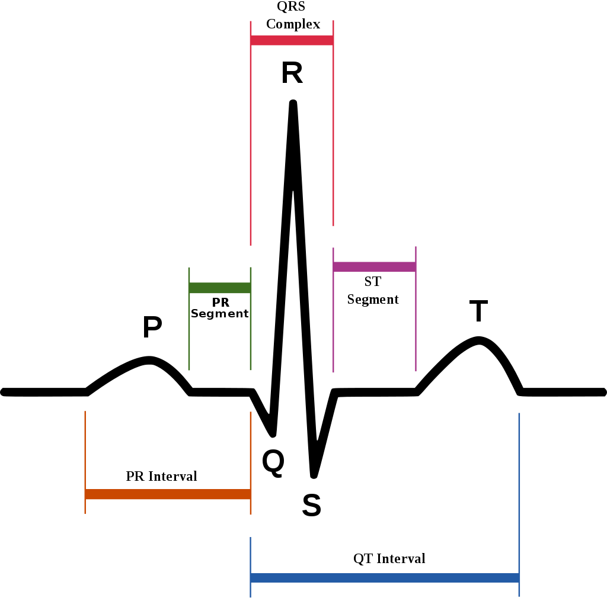
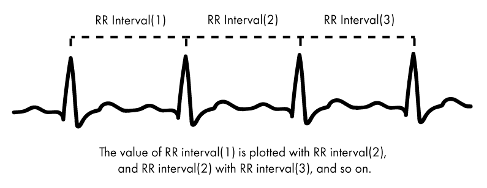
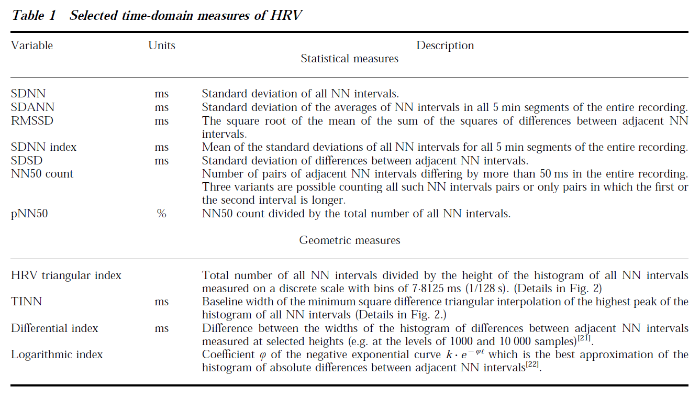
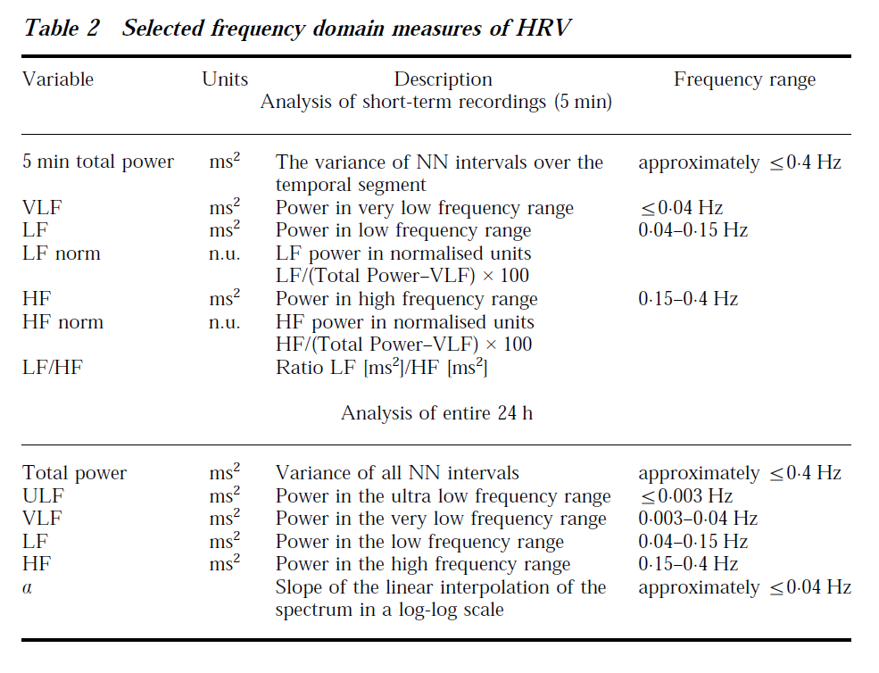

## Basic terminology
  - [QRS](https://en.wikipedia.org/wiki/QRS_complex): The QRS complex is a name for the combination of three of the graphical deflections seen on a typical electrocardiogram (EKG or ECG). In other words, it's the main spike seen on an ECG line.
    
	
  - [R-R interval](https://emedicine.medscape.com/article/2172196-overview)
    
  - [Normal-to-Normal(NN) interval](https://psychology.stackexchange.com/questions/16076/what-is-the-difference-between-rr-intervals-and-nn-intervals-in-hrv-data) (filter RR intervals to produce NN intervals): all intervals between adjacent QRS complexes resulting sinus node depolarization.
     - The difference between RR interval and NN interval: NN intervals refer to the intervals between **normal** R-peaks. During a measurement, artifacts may arise due to arrhythmic events or faulty sensors, for example (Citi, Brown & Barbieri, 2012). This may lead to abnormal R-peaks, which may in turn distort the statistical measures. To ensure reliable and valid data, only normal R-peaks are selected. Alternatively, the abnormal R-peaks can be corrected. 
	 In practice, however, RR-intervals and NN-intervals are synonymous (Tarvainen, 2014; Wiki). The use of "NN-intervals" is merely used to emphasize that normal R-peaks were used. 
  - [Heart Rate](https://en.wikipedia.org/wiki/Heart_rate): [The instantaneous heart rate](https://courses.kcumb.edu/physio/ecg%20primer/normecgcalcs.htm) can be calculated from the time between any two QRS complexes. 
  - RR Intervals, Heart Rate, and HRV Howto (by [George B. Moody, Harvard-MIT Division of Health Sciences and Technology](https://www.physionet.org/tutorials/hrv/#hr-extraction))

### Heart rate variability:
  - [HRV standards,1996](https://www.ncbi.nlm.nih.gov/pubmed/8737210)
     
	 
	 
	 
	  
  - [wikipedia HRV](https://en.wikipedia.org/wiki/Heart_rate_variability)
  - [Heart rate variability – a historical perspective, 2011](https://www.frontiersin.org/articles/10.3389/fphys.2011.00086/full)
  - [An introduction to heart rate variability: methodological considerations and clinical applications, 2015](https://www.frontiersin.org/articles/10.3389/fphys.2015.00055/full#B1)
  
#### PhysioNet, 2016: 
  - [WFDB Toolbox for MATLAB and Octave](https://www.physionet.org/physiotools/matlab/wfdb-app-matlab/)
  - [New PhysioNet website](https://alpha.physionet.org/): The Research Resource for Complex Physiologic Signals

##### **Test "Usage" example: refer to Github [mhrv](https://github.com/physiozoo/mhrv) (main function toolbox with an example and results pictures ):**
	   
  1. Initialize MATLAB environment of the mhrv tools: 
	```
	mhrv_init [-f/--force];
	```
  2. If there is no example dataset,download the mitdb/111 record from PhysioNet to local folder named 'db': 
	```
	download_wfdb_records('mitdb', '111', 'db')';
	```  	
  3. Run HRV analysis: 
	```
	mhrv('db/mitdb/111', 'window_minutes', 15, 'plot', true);
	```
  - key functions:
	
	**Data Process**
	  ```
	  wfdb_header - Read record metadata from a WFDB header file (.hea).
	  ecgrr - Construction of RR intervals from ECG data in PhysioNet format.
		- ecgrr calls **rqrs** (Detection of R-peaks in ECG signals (based on PhysioNet's gqrs). Configurable for use with both human and animal ECGs._
		- rqrs calls **jqrs/wjqrs** (An ECG peak-detector based on a modified Pan & Tompkins algorithm and a windowed version.
	  filtrr - Filtering of RR interval time series to detect ectopic (out of place) beats.
	  ```
	**hrv_time** - Time Domain: 
	  ```
		- AVNN: Average NN interval duration.
		- SDNN: Standard deviation of NN interval durations.
		- RMSSD: Square root of mean summed squares of NN interval differences.
		- pNNx: The percentage of NN intervals which differ by at least x (ms)(default 50) from their preceding interval. The value of x in milliseconds can be set with the optional parameter 'pnn_thresh_ms'.
		- SEM: Standard error of the mean NN interval length.
	  ```
	**hrv_freq** - Frequency Domain (Spectral power estimation using Lomb, Auto Regressive, Welch and FFT methods): 	
	  ```
		- TOTAL_POWER: Total power in all three bands combined.
		- VLF_POWER: Power in the VLF band.
		- LF_POWER: Power in the LF band.
		- HF_POWER: Power in the HF band.
		- VLF_NORM: 100 * Ratio between VLF power and total power.
		- LF_NORM: 100 * Ratio between LF power and total power or the sum of LF and HF power (see 'norm_method').  - HF_NORM: 100 * Ratio between HF power and total power or the sum of LF and HF power (see ``norm_method``).
		- LF_PEAK: Frequency of highest peak in the LF band.
		- HF_PEAK: Frequency of highest peak in the HF band.
		- BETA: Slope of log-log frequency plot in the VLF band.
	  ```
	**HRV_non-linear**: based on Poincaré plots, detrended fluctuation analysis (DFA) and Multiscale Entropy (MSE).
	  ```
		- SD1: Poincare plot SD1 descriptor (std. dev. of intervals along the line perpendicular to the line of identity).
		- SD2: Poincare plot SD2 descriptor (std. dev. of intervals along the line of identity).
		- alpha1: Log-log slope of DFA in the low-scale region.
		- alpha2: Log-log slope of DFA in the high-scale region.
		- SampEn: The sample entropy.
	  ```
	**HRV_fragmentation**:
	  ```
		- PIP: Percentage of inflection points.
		- IALS: Inverse average length of segments.
		- PSS: Percentage of NN intervals that are in short segments.
		- PAS: Percentage of NN intervals that are in alternation segments of at least 4 intervals. 			  
	  ```	  
	  
  - Notes: 
	 - Missing padarray function (from Image Processing Toolbox); here using several [online functions](https://github.com/gpeyre/matlab-toolboxes/tree/master/toolbox_nlmeans/toolbox/ordfilt2) ([padarray.m](padarray.m) calls [checkstrs.m](checkstrs.m) and [mkconstarray.m](mkconstarray.m)) to substitute.
	 - [File Format from Q&A](https://physionet.org/faq.shtml): 
	    - MIT Signal files (.dat) are binary files containing samples of digitized signals. These store the waveforms, but they cannot be interpreted properly without their corresponding header files. These files are in the form: RECORDNAME.dat.
		- MIT Header files (.hea) are short text files that describe the contents of associated signal files. These files are in the form: RECORDNAME.hea.
		- MIT Annotation files are binary files containing annotations (labels that generally refer to specific samples in associated signal files). Annotation files should be read with their associated header files. If you see files in a directory called RECORDNAME.dat, or RECORDNAME.hea, any other file with the same name but different extension, for example RECORDNAME.atr, is an annotation file for that record.
	 - Modify default parameter values of the mhrv toolbox: you can edit [cfg/defaults.yml](defaults.yml), and [cfd/gqrs.conf](gqrs.default.conf)
 
##### **Work on our ECG and RR-interval data output from [Biomonitor](https://www.noraxon.com/noraxon-download/dts-biomonitor-user-manual/):**
  - confirm the RR-interval output:
	- normal RR interval [range](https://emedicine.medscape.com/article/2172196-overview): 0.6-1.2 seconds; 
	- more information on [peak detection](https://docs.physiozoo.com/en/stable/sections/tutorials/peakdetection.html) 
	- modify the [cfd/gqrs.conf](gqrs.default.conf):
	- current default: 
		```
		RRdelta	0.2	# Typical difference between successive RR intervals in seconds
		RRmin	0.28	# Minimum RR interval ("refractory period"), in seconds
		```
	- Change to 
		```
		RRdelta	0.6	# Typical difference between successive RR intervals in seconds
		RRmin	0.6	# Minimum RR interval ("refractory period"), in seconds
		```
	- use [ECG2RRi_test.m](ECG2RRi_test.m) to compare the RRi calucated from ECG (mhrv, rqrs: R-peak detection) and Biomonitor-output RRi, which were comparable after changing [cfd/gqrs.conf](gqrs.default.conf) as above.
					
    - check data from a sample trial: use [mhrv_fatigue_test.m](mhrv_fatigue_test.m) (which calls [interparc.m](interparc.m) and run it on the local drive using "E:\ECG\mhrv-master\mhrv_fatigue_test.m")
	  - need to decide on what to use for nni:
		1. rri output from Biomonitor --> remove flat "step" data in rri (using [rmvStep.m](rmvStep.m))--> filtered (use "filtrr") --> maybe resample the nni??
		2. rri from ECG ("ecgrr") --> resample (interparc) --> filter (filtrr)
		3. rri from ECG ("ecgrr") --> filter (filtrr) --> resample (interparc) 
	- HRV analysis: using hrv_time, hrv_freq, hrv_nonlinear and hrv_fragmentation.
		- Align RPE reading:
		  - plot all the HRV parameters from 4 trials in individual figures [plot_Force_RPE_HRV_4plots.m](plot_Force_RPE_HRV_4plots.m) "; calls [hrv_table_fcn.m](hrv_table_fcn.m), which generates HRV table)
			- [hrv_table_fcn.m](hrv_table_fcn.m) has issues with selected small windows (e.g., 10 seconds) in hrv_frequency and hrv_nonlinear and hrv_fragmentation
		  - try to modify [plot_Force_RPE_HRV_4plots.m](plot_Force_RPE_HRV_4plots.m) using [hrv_table_fcn_noResampling.m](hrv_table_fcn_noResampling.m) and [hrv_table_fcn_Resampling.m](hrv_table_fcn_Resampling.m)  (**10/17/2018**)
 						
##### Maybe test the online dataset in the future: [Stress Recognition in Automobile Drivers](https://physionet.org/physiobank/database/drivedb/)
 
  
#### Other realted tools: 

	- Kaufmann, 2011: [ARTiiFACT](http://www.artiifact.de/) 
	- [Kubios: from XS](https://www.kubios.com/gallery/)
	- Vollmer, 2017 (HRVTool v0.99 from Github): [MarcusVollmer/HRV](https://github.com/MarcusVollmer/HRV)
	- [PhysioZoo](https://physiozoo.com/)
	   - Github [webpage](https://github.com/physiozoo)
       - Github [physiozoo](https://github.com/physiozoo/physiozoo)
    - iMotions: [HRV and brain](https://imotions.com/blog/heart-rate-variability/)

### Readings on heart dynamics	
#### HRV on Autonomic Nervous System (ANS) — PSN and SNS (notes from SX):
  - HF (0.15–0.40 Hz): associated with respiratory sinus arrhythmia, and has been attributed to parasympathetic (vagal) activity.
  - LF (0.04–0.15 Hz): assumed to be under the influence of both parasympathetic and sympathetic activity, but predominately by sympathetic activity.
  - LF/HF ratio: a putative measure of sympathovagal balance where higher numbers indicate greater relative sympathetic dominance. 
  - Root Mean Square Successive Differences (RMSSD) and measures of baroreflex sensitivity (an index of the responsiveness of the cardiovascular system to changes in blood pressure) have been shown to be useful indices of vagal activity. 	

  - Notes: Difference between [parasympathetic nervous system(**PNS**) and sympathetic nervous system (**SNS**)](https://www.diffen.com/difference/Parasympathetic_nervous_system_vs_Sympathetic_nervous_system)

#### HRV studies during resting and exercise
  - [Fatigue shifts and scatters heart rate variability in elite endurance athletes,2013](https://www.ncbi.nlm.nih.gov/pubmed/23951198)
  - [Heart Rate Variability: what it is and how It helps with training and racing](https://philmaffetone.com/hrv/)
	- Record the resting heart beat for one minute (resting HRV);
	- Analogy: the sympathetic --- the accelerator in your car, making the vehicle go faster; parasympathetic conponent is likened to the brakes, slowing it down
	- [sensor](http://www.myithlete.com/products/)
  - [Muscle metaboreflex contribution to sinus node regulation during static exercise: insights from spectral analysis of heart rate variability](https://www.ncbi.nlm.nih.gov/pubmed/10393677)
  - [Heart rate variability and physical exercise. Current status](https://www.ncbi.nlm.nih.gov/pubmed/17036185)
  - [Stability over time of short-term heart rate variability](https://www.ncbi.nlm.nih.gov/pubmed/16362542)
  - [The use of heart rate variability measures to assess autonomic control during exercise](https://www.ncbi.nlm.nih.gov/pubmed/16774653)
  - [Heart rate variability and swimming](https://www.ncbi.nlm.nih.gov/pubmed/24958562)
  - [Non-linear dynamics of heart rate variability during incremental cycling exercise](https://www.ncbi.nlm.nih.gov/pubmed/30040499) (Gronwald, 2018)
	- Using detrended fluctuation analysis (DFA)to assess heart rate correlation properties, the present study examines the influence of exercise intensity on total variability and complexity in non-linear dynamics of HRV.
	- DFA-alpha1 increased from rest to low exercise intensity and showed an almost linear decrease from higher intensities until exhaustion.
  - [Musculoskeletal overuse injuries and heart rate variability: Is there a link? Gisselman-2016](https://www.ncbi.nlm.nih.gov/pubmed/26826630)
	  
#### HRV on Prefrontal cortex
  - [Higher Heart-Rate Variability Is Associated with Ventromedial Prefrontal Cortex Activity and Increased Resistance to Temptation in Dietary Self-Control Challenges](https://www.neurovault.org/collections/DNXFVQPJ/)
    - [neurogynth.org](http://neurosynth.org/analyses/terms/heart/)
    - [NeuroVault.org](https://www.frontiersin.org/articles/10.3389/fninf.2015.00008/full)

  - [Heart rate variability is associated with amygdala functional connectivity with MPFC across younger and older adults](https://www.ncbi.nlm.nih.gov/pubmed/27261160)

#### **HRV on fatigue**
- Mental Fatigue  
  - [Mental Fatigability and Heart Rate Variability in Mild Cognitive Impairment](https://www.ncbi.nlm.nih.gov/pubmed/26905050);
  - [Dissociation between mental fatigue and motivational state during prolonged mental activity, 2015](https://www.ncbi.nlm.nih.gov/pubmed/26217203);

- Physical Fatigue	  
  - [Can cognitive activities during breaks in repetitive manual work accelerate recovery from fatigue? A controlled experiment, 2014](https://www.ncbi.nlm.nih.gov/pubmed/25375644)
  - [Impacts of obesity and stress on neuromuscular fatigue development and associated heart rate variability, 2015](https://www.ncbi.nlm.nih.gov/pubmed/25042859)
  - [Changes in physical activity and heart rate variability in chronic neck-shoulder pain: monitoring during work and leisure time, 2014](https://www.ncbi.nlm.nih.gov/pubmed/24162088)
  - [Shift Work and Heart Rate Variability Coherence: Pilot Study Among Nurses,2018](https://www.ncbi.nlm.nih.gov/pubmed/30232570)
  - [**Heart rate variability analysis during muscle fatigue due to prolonged isometric contraction, by Gaetano group**](https://www.ncbi.nlm.nih.gov/pubmed/29060120)(Guidi, 2017)
	 - Comparing the fatigue group with non-fatigue one
	 - Time domain: significant reduced RMSSD and NN50 values;
	 - Frequency domain: increased LF and reduced HF;
	 - Non linear features: lower SD1.			


## Others
  - from Cognitive Neuroscienty Society (CNS) Meeting ([previous meeting programs and abstracts](https://www.cogneurosociety.org/annual-meeting/general-information/previous-meetings/))
    - [CNS 2018 Blog](https://www.cogneurosociety.org/cns-2018-blog/) 
	  - [Girls v. Boys: No Gender Differences in Neural Processing of Math](https://www.cogneurosociety.org/girls-v-boys-no-gender-differences-neural-processing-math/)
	 
    - Predicting Automation Aid Response Time from EEG versus Low Cost Wearable Devices (Poster F102; page 338-339 on [CNS 2018 abstract book](https://www.cogneurosociety.org/2019/wordpress/wp-content/uploads/2018/10/CNS2018_Abstract_Book.pdf))
	  - In the current investigation we compared the predictive capability of spectral analyses obtained from a laboratory
	grade EEG system (NuAmps) to the predictive capability of low cost wearable devices (heart rate variability obtained from the
	ZepherTM Biomodule strap and gaze dispersion from eye tracking glasses developed by Pupil Labs)...Participants performed five
	autonomous driving sessions (drives) (~11 min each) during which they monitored an autonomous vehicle lane change task and
	made manual responses to indicate detection of infrequent (20%) automation aid failures signaled by a visual display. Separate
	Linear Mixed-Effects (LMEs) analyses were used to predict response time (RT) to detection failures using spectral analysis of Pz
	alpha-band in comparison to HR, vertical and horizontal gaze dispersion... However, the model using low cost wearable devices was less robust (df(19), BIC = 1970.66) indicating that at present, improved
	sensor technologies are required before wearable devices can achieve the same predictive capabilities of more traditional
	laboratory physiological metrics.
  
  
