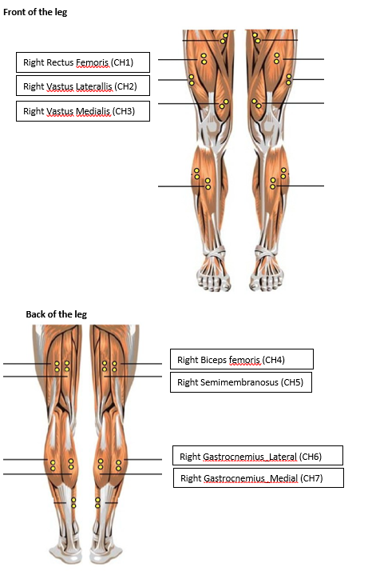
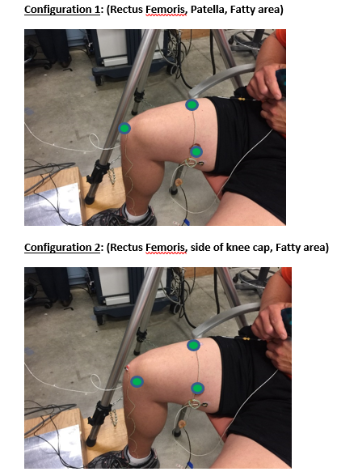

## Isometric Leg Contraction (sitting posture; 90-degree knee angle)
   
   **Tasks:**
   - Reference trials:  resting and the maximum exertion (MVC trials).
   - 60% or 30% of the maximum exertion trials (MVC30_Fatigue or MVC60_Fatigue): hold until fatigue (RPE values were asked every 20-60seconds)
   - The maximum exertion level was checked everty time after the fatiguing trials
   
   **Measurements:**
   - EMG: recorded on seven leg muscles
   
     - 
   
   - VMG: recorded on three locations (muscle, bone and "fatty" area)
    - 
   
   - NIRS
   
   - Kinematics
   
   
