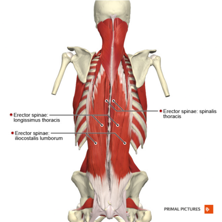

## NIU data 
- one lifting task
- 8 patient handling tasks

### EMG data
- EMG on two muscles: left and right erector spine
- time (s) vs. EMG rms
- Question: EMG sampling rate?

  

In Results folder: 
- LES: left erector spine
- RES: right erector spinae

- PH: patient handling
- LL: lifting/lowering session

### Heart Rate
- time (s) vs. ECG (mV)
- Analysis (look at the previous [ECG notes](https://github.com/zlyreed/TIRED/tree/master/Leg%20fatigue/Matlab/ECG_related))
- time-domain analysis (HR, HRV)
- frequency-domain analysis

### Kinematics
- Joint angles (3D angles at 10 joints; total 30 angles): time (s) vs. Angle (deg)
- Questions:
  - definition for each joint angle
  - cooridinate systems (X, Y, and Z)
  - unit? Deg?

### Force plate data
### Modeling
